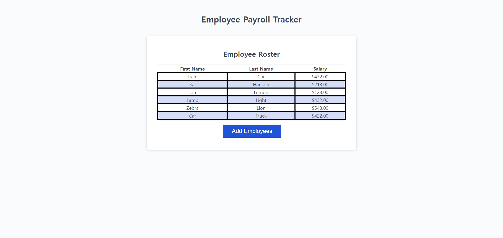
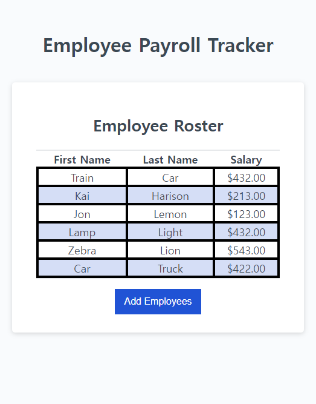

# Payroll Manager

## Description

An application to view and manage employee payroll data. The window will have responsive user interface that adapts to multiple screen sizes.

## Installation

N/A

## Usage

Track and display employees payroll, calculate their average

## Credits

N/A

## Features

None

## Tests

Run the website online and check if there's any spelling errors or bugs

## Screenshots

The following image shows the web application's appearance and functionality:
Desktop version

Phone version

